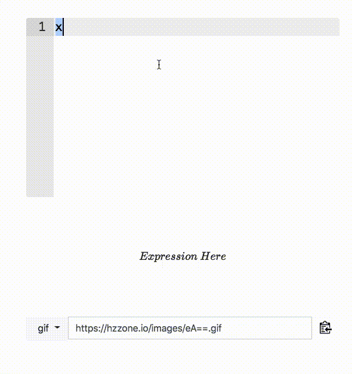

# online-latex-mathmatical-fomula

### 介绍
为了解决 [GitHub 支持 LaTex 的几种方案以及 LaTeX 生成 svg](https://github.com/Hzzone/Hzzone.github.io/issues/7)，我最后还是自己实现了一个在线 Latex 数学编辑。

支持的功能和原理如下:
* 实时预览: [MathJax](https://www.mathjax.org/) 实时渲染公式
* 导出 gif/png/svg 和外链: 保存在本地 nginx/images，并使用 [clipboard.js](https://clipboardjs.com/) 自动粘贴。
* 使用 [codecogs](http://www.codecogs.com/latex/eqneditor.php) API，但是保存本地目录。
* 自动补全和高亮: [Ace Editor](https://ace.c9.io/) 的 LaTeX 模式和 chrome 主题。

### LaTex Fomula to SVG
将 LaTex 公式转 SVG 图片，有几种方法，转其他格式的图片可以使用其他的 API:
* codecogs API

访问有限制，需要额外的错误控制。请求、生成一张图片总共花费大概 ~2s，效果如下:

<div align="center">
    
</div>

* tex2svg

来源于 [How to convert LaTeX equations to SVG?](https://askubuntu.com/questions/33196/how-to-convert-latex-equations-to-svg)。

安装命令行工具:

```shell
npm install --global https://github.com/mathjax/mathjax-node-cli.git
```

转换一个公式:

```shell
tex2svg '\sin^2{\theta} + \cos^2{\theta} = 1' > mathjax.svg
```
花费 ~2s，比 codecogs 略长，效果如下:

<div align="center">
    
</div>

* latex 和 dvisvgm

首先 ubuntu 需要安装 LaTex:

```shell
sudo apt-get install texlive-full
```

```latex
\documentclass[paper=a5,fontsize=15px]{scrbook}
\usepackage[pdftex,active,tightpage]{preview}
\usepackage{amsmath}
\usepackage{amssymb}
\usepackage{amsfonts}
\usepackage{tikz}
\begin{document}
\begin{preview}
\begin{tikzpicture}[inner sep=0pt, outer sep=0pt]
\node at (0, 0) {\begin{math}\sin^2{\theta} + \cos^2{\theta} = 1\end{math}}; % <--Put your tex-code here
\end{tikzpicture}
\end{preview}
\end{document}
```

```shell
➜  tmp time latex test.tex
...
latex test.tex  0.20s user 0.03s system 87% cpu 0.264 total
```
```shell
time dvisvgm --no-fonts test.dvi test.svg
...
dvisvgm --no-fonts test.dvi test.svg  0.19s user 0.01s system 93% cpu 0.211 total
```
这种方法最长也就 ~0.2s，比上面两种短的多得多，效果如图:

<div align="center" style="height: 16px;">
    
</div>

* pdflatex 和 inkscape

未测试，和上一种方法时间上差不多，但是看生成的 pdf 比较好看，没有导出 svg，pdf 效果如下:

<div align="center" style="height: 16px;">
    
</div>

* svg to png

[CairoSVG](https://cairosvg.org/) 将 svg 转 png

ubuntu:
```
sudo apt-get install libcairo2-dev
sudo apt-get install libffi-dev
pip3 install cairosvg
```

**综上，其实最后两种方法速度最快且效果很好**

```shell
ssh://ubuntu@hzzone.io:22/home/ubuntu/miniconda3/bin/python3 -u /home/ubuntu/online-latex-mathmatical-fomula/benchmark.py
  1%|▎                                    | 695/68883 [02:45<4:30:15,  4.21it/s]
```

### 使用
在线预览: [demo](https://hzzone.io/api/latex)




可以研究一下代码，非常简单，只需要改几个链接就可以架设到自己的服务器上。

### 相关问题

* mathjax 和 js 的转义字符相冲突

使用 js 替换 latex 转义字符，就不需要在编辑器中再转义一次:
```js
expression = expression.replace(/\\\\/g, '\\\\\\\\');
expression = expression.replace(/\\ /g, '\\\\ ');
expression = expression.replace(/\\%/g, '\\\\%');
expression = expression.replace(/\\{/g, '\\\\{');
expression = expression.replace(/\\}/g, '\\\\}');
expression = expression.replace(/\\#/g, '\\\\#');
expression = expression.replace(/\\~/g, '\\\\~');
expression = expression.replace(/\\_/g, '\\\\_');
expression = expression.replace(/\\&/g, '\\\\&');
expression = expression.replace(/\\\$/g, '\\\\$');
expression = expression.replace(/\\\^/g, '\\\\^');
```

